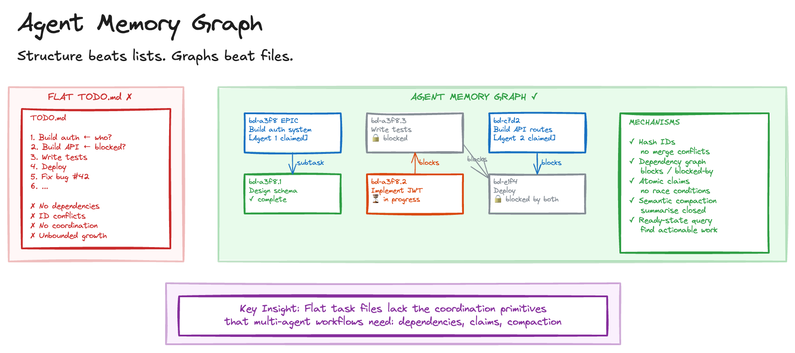

# Agent Memory Graph

> **In plain terms:** AI agents tracking tasks in flat to-do lists break down when work has dependencies, multiple agents run in parallel, or projects span many sessions. A memory graph replaces the flat list with a structured map of tasks, dependencies, and ownership.
>
> **What is it?** A structured graph replacing flat task files, with dependency tracking, collision-resistant IDs, hierarchical decomposition, and atomic task claiming for multi-agent work.
> **What's in it for you?** Multiple agents working concurrently without conflicts, with automatic identification of what's actionable next.
> **What are the trade-offs?** Adds infrastructure complexity that single-agent, single-session workflows don't need.

Agents managing multi-step work typically use flat files - TODO.md, task lists - for memory. These work fine for a single agent on a small task. They break down as complexity grows.

Flat lists cannot express "task B is blocked by task A." Sequential IDs collide when multiple agents work in parallel. Completed tasks accumulate, consuming context with irrelevant history. Two agents can claim the same task simultaneously. And subtasks lose their connection to parent goals.

These problems become acute with multi-agent workflows, long-running projects, or hierarchical task decomposition.

## Sketch

## How It Works

The approach replaces flat task files with a structured graph that tracks dependencies, supports safe multi-agent coordination, and compacts history to stay within context limits.

The graph rests on several core mechanisms.

_Dependency-aware relationships_: Tasks link via explicit relationships (blocks, blocked-by, relates-to, supersedes). Agents query for ready tasks - those with zero open blockers - rather than scanning the full list.

_Hash-based identifiers_: Tasks use collision-resistant IDs (e.g. `bd-a1b2`) rather than sequential numbers. Multiple agents creating tasks simultaneously never collide.

_Hierarchical decomposition_: Tasks decompose into subtasks (e.g. `bd-a1b2.1`, `bd-a1b2.1.1`) preserving parent-child lineage. Agents can zoom in or out on the task tree.

_Semantic compaction_: When tasks close, their content is summarised and the full detail is archived. The graph stays compact without losing institutional knowledge.

_Atomic claims_: A single operation claims a task and marks it in-progress, preventing race conditions in multi-agent scenarios.

## The Trade-offs

The benefits centre on coordination. Multiple agents can work concurrently without task conflicts. Dependency resolution lets agents automatically identify actionable work. Compaction keeps the working set small regardless of project history. Summarised history retains learnings without consuming active context. And complex goals decompose naturally into trackable sub-goals.

The costs are primarily about complexity. This needs purpose-built infrastructure, not just a text file. Graph management is more complex than a simple list. Agents and humans must understand graph operations. And a single agent on a simple task doesn't need this machinery.

## When to Use It

This pattern earns its keep in multi-agent workflows where coordination is essential, long-running projects spanning multiple sessions, hierarchical task decomposition with complex dependencies, and teams wanting persistent, structured agent memory across sessions.

For single-agent, single-session tasks, simple linear workflows with no dependencies, and situations where a flat TODO.md is genuinely sufficient, it's unnecessary overhead.

This enables [Agent Swarm](agent-swarm.md) by providing the coordination layer for parallel workers, supports [Autonomous Agent](autonomous-agent.md) by giving agents structured task selection, and complements [Detached Agent](detached-agent.md) where issue trackers serve a similar but less agent-native purpose.

## Maturity

**Assess.** Solves a real coordination problem for multi-agent workflows, but adds complexity that single-agent setups don't need. Worth evaluating when flat task files start breaking down.

## Further Reading

- [Beads: A Coding Agent Memory System](https://github.com/steveyegge/beads) - Steve Yegge
