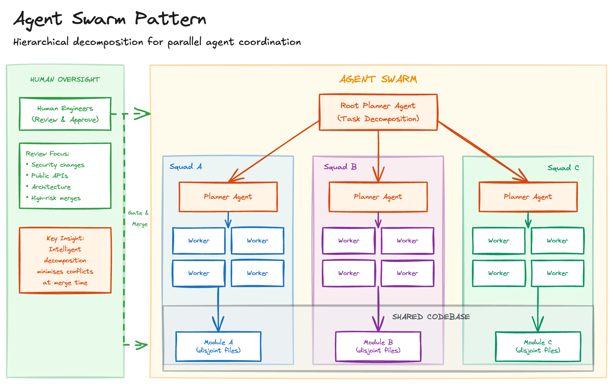

# Agent Swarm

> **Pattern in Research**: This pattern describes a direction rather than current best practice. Demonstrated in specific high-resource contexts (dedicated hardware, thousands of concurrent agents) but not yet widely reproduced. Infrastructure requirements are steep, decomposition strategies are still being understood, and **human review remains essential**. Treat this as a lens for evaluating where agentic tooling may head, not a recommendation for immediate adoption.

## Sketch

## Problem

Scaling from one agent to many creates coordination problems. Multiple agents working on the same codebase simultaneously:

- **Merge conflicts**: Agents modify the same files, creating conflicts that require manual resolution
- **Duplicated work**: Without visibility into what others are doing, agents solve the same problems independently
- **Integration failures**: Independently correct changes combine into broken states

The naive approach of "just run more agents" quickly degrades. Conflict resolution and rework consume the time gained from parallelism. Beyond a handful of concurrent agents, throughput plateaus or declines.

## Solution

Deploy a hierarchical swarm of agents: planning agents decompose work into non-overlapping tasks, worker agents execute those tasks in parallel. The decomposition strategy minimises merge conflicts by design. Design the swarm so human engineers remain in the loop to review, approve, and intervene on accuracy, security, and/or architecture sensitive changes.

### How It Works

1. **Hierarchical structure**: Planning agents sit above worker agents in a tree
2. **Task decomposition**: Planners break complex work into discrete, non-overlapping assignments
3. **Parallel execution**: Workers execute assigned tasks concurrently
4. **Conflict minimisation**: Decomposition deliberately avoids simultaneous work on shared code
5. **Error tolerance**: Small errors in intermediate commits get fixed quickly rather than blocking progress
6. **Controls**: Human reviewers gate merges (especially to release branches); judge agents should escalate and block when tests/security checks fail rather than merely flagging. Use automated AI pre-reviews to reduce reviewer load but keep final authority with humans for high-risk changes.

## Costs and Benefits

### Benefits

- **Parallelism**: Potential for very high parallelism exists but only in controlled, high-infrastructure settings with disciplined verification; scale does not guarantee quality and integration failures are common without rigorous orchestration
- **Subsystem isolation**: Dedicated machines per subsystem reduce interference
- **Human oversight where it matters**: Agents free engineers from repetitive work so humans can concentrate on review, security, and architectural integrity.

### Costs

- **Infrastructure complexity**: Orchestration, monitoring, and compute resources
- **Quality variance**: Output quality varies across agents and tasks
- **Debugging difficulty**: Tracing issues across swarm history is harder
- **Human review overhead**: Mandatory checkpoints and targeted reviews add process overhead, acceptable tradeoff to maintain correctness, security, and design intent.
- **Throughput risk**: throughput may collapse under naive locking or poorly designed optimistic concurrency.

## Guardrails

Introduce explicit guardrails to shift checks left and keep the swarm productive:

- Pre-commit checks and CI gates that run before merges to main/release branches
- Cyclomatic complexity, function length, and duplication thresholds to block low-quality large commits
- Automated AI pre-review agents that annotate PRs and surface probable issues to human reviewers
- Git-backed memory (JSONL issues) and a repository map/context-engineering layer so agents load only relevant context
- Consider formal verification for security-critical subsystems

## When to Use

- When you have both infrastructure and disciplined verification processes (explicit planning phases, pre-commit guardrails, CI that can reject noisy merges)
- Organisations with infrastructure to run many concurrent agents
- Work that benefits from specialisation (different agents for different subsystems)

## When NOT to Use

- When you lack the processes to enforce guardrails
- Small projects where coordination overhead exceeds benefits
- Tightly-coupled code that resists decomposition
- Brownfield projects with unclear boundaries
- Teams without infrastructure to orchestrate multiple agents
- Work requiring deep cross-cutting changes

## Related Patterns

- [Detached Agent](detached-agent.md): Provides the async execution infrastructure swarms build on
- [Autonomous Agent](autonomous-agent.md): Individual agent self-direction; swarms add coordination across agents
- [Context Library](context-library.md): Shared standards keep swarm output consistent
- [Authoritative Source Anchor](authoritative-source-anchor.md): Shared specs ground swarm decisions

## Sources

- [FastRender development approach](https://simonwillison.net/2026/Jan/23/fastrender/) - Wilson Lin's use of ~2,000 concurrent agents generating 30,000+ commits
