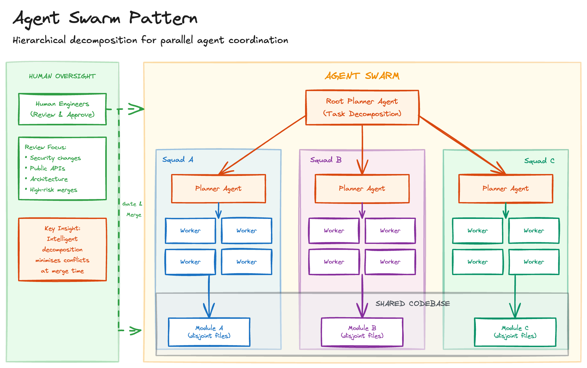

# Agent Swarm

> **Pattern in Research**: This pattern describes a direction rather than current best practice. It has been demonstrated in specific high-resource contexts (dedicated hardware, thousands of concurrent agents) but not yet widely reproduced. Infrastructure requirements are steep, decomposition strategies are still being understood, and human review remains essential. Treat this as a lens for evaluating where agentic tooling may head, not a recommendation for immediate adoption.

Scaling from one agent to many creates coordination problems that are harder than they first appear. Multiple agents working on the same codebase simultaneously produce merge conflicts that require manual resolution. Without visibility into what others are doing, agents solve the same problems independently. And independently correct changes combine into broken states at integration time.

The naive approach of "just run more agents" quickly degrades. Conflict resolution and rework consume the time gained from parallelism. Beyond a handful of concurrent agents, throughput plateaus or declines.

## Sketch

## How It Works

The approach deploys a hierarchical swarm: planning agents decompose work into non-overlapping tasks, worker agents execute those tasks in parallel. The decomposition strategy minimises merge conflicts by design. Human engineers remain in the loop to review, approve, and intervene on accuracy-sensitive, security-sensitive, and architecture-sensitive changes.

The structure is straightforward. Planning agents sit above worker agents in a tree. Planners break complex work into discrete, non-overlapping assignments. Workers execute assigned tasks concurrently. Decomposition deliberately avoids simultaneous work on shared code. Small errors in intermediate commits get fixed quickly rather than blocking progress. And human reviewers gate merges, especially to release branches, with automated AI pre-reviews to reduce reviewer load while keeping final authority with humans for high-risk changes.

### Guardrails

Explicit guardrails keep the swarm productive. Pre-commit checks and CI gates run before merges to main or release branches. Cyclomatic complexity, function length, and duplication thresholds block low-quality large commits. Automated AI pre-review agents annotate PRs and surface probable issues to human reviewers. And git-backed memory with a repository map and context-engineering layer ensures agents load only relevant context.

## The Trade-offs

The potential for high parallelism exists, but only in controlled, high-infrastructure settings with disciplined verification. Scale does not guarantee quality, and integration failures are common without rigorous orchestration. Dedicated machines per subsystem reduce interference. And agents free engineers from repetitive work so humans can concentrate on review, security, and architectural integrity.

The costs are significant. Orchestration, monitoring, and compute resources add infrastructure complexity. Output quality varies across agents and tasks. Tracing issues across swarm history is harder than single-agent debugging. Human review checkpoints add process overhead, though this is an acceptable trade-off for maintaining correctness. And throughput may collapse under naive locking or poorly designed optimistic concurrency.

## When to Use It

This pattern works when you have both infrastructure and disciplined verification processes: explicit planning phases, pre-commit guardrails, CI that can reject noisy merges. It suits organisations with infrastructure to run many concurrent agents and work that benefits from specialisation across different subsystems.

Avoid it when you lack the processes to enforce guardrails, on small projects where coordination overhead exceeds benefits, with tightly-coupled code that resists decomposition, in brownfield projects with unclear boundaries, and for work requiring deep cross-cutting changes.

This builds on [Detached Agent](detached-agent.md) for async execution infrastructure. [Autonomous Agent](autonomous-agent.md) adds individual agent self-direction; swarms add coordination across agents. [Context Library](context-library.md) and [Authoritative Source Anchor](authoritative-source-anchor.md) keep swarm output consistent and grounded. And [Agent Memory Graph](agent-memory-graph.md) provides the coordination primitives that swarms need for parallel work.

## Further Reading

- [FastRender development approach](https://simonwillison.net/2026/Jan/23/fastrender/) - Wilson Lin's use of ~2,000 concurrent agents generating 30,000+ commits
