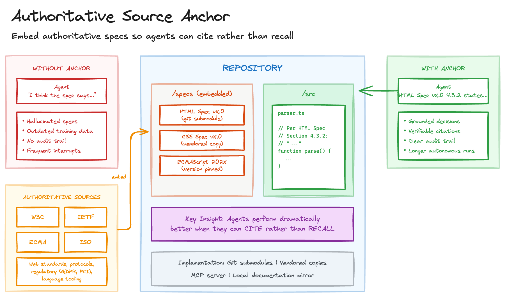

# Authoritative Source Anchor

> **In plain terms:** AI agents working on standards-compliant code often guess at specifications rather than citing them - producing confident-sounding output that's subtly wrong. Embedding the actual specs in your repository lets agents cite rather than recall, dramatically improving accuracy.
>
> **What is it?** Embedding authoritative external specifications directly in the repository so agents reference the real thing instead of relying on memory.
> **What's in it for you?** Fewer hallucinated standards, longer autonomous runs, and an audit trail from decisions to specific spec sections.
> **What are the trade-offs?** Increases repository size and requires keeping embedded specs current.

AI agents working on standards-compliant code face a subtle problem: they must make decisions about specifications they weren't trained on, or can't recall accurately. Without access to the canonical source, agents hallucinate specifications with alarming confidence, generate code based on outdated understanding, and leave no audit trail for verification.

The result is either unreliable output or frustratingly short autonomous runs punctuated by constant human checking.

## Sketch

## How It Works

The fix is to embed authoritative external specifications directly in the repository, making canonical sources available to agents during development.

The process is straightforward. Add authoritative sources to the repository through git submodules, vendored docs, or local mirrors. Structure and index them so agents can navigate to relevant sections. When agents implement standards-dependent behaviour, they cite specific sections rather than relying on recall. Pin to specific versions so builds are reproducible and citations remain valid.

The key insight is that agents perform dramatically better when they can *cite rather than recall*. LLMs trained on web content have seen specifications, but training data may be outdated, recall is probabilistic rather than precise, edge cases and nuances get lost, and there's no way to distinguish confident recall from hallucination.

### Implementation Approaches

There are several ways to make this work in practice:

| Approach | Pros | Cons |
| --- | --- | --- |
| Git submodules | Version-pinned, standard tooling, works offline | Repository bloat, submodule complexity |
| Vendored copies | Simple, no external dependencies | Manual updates, potential licensing issues |
| MCP server | Dynamic access, no repo bloat | Requires infrastructure, network dependency |
| Local documentation mirror | Fast access, searchable | Storage overhead, sync maintenance |

## The Trade-offs

The gains are clear: reduced hallucination, longer autonomous runs with fewer interruptions, an audit trail tracing decisions to specific spec sections, and reproducible builds through pinned versions. New agents and humans alike benefit from having specs at hand.

The costs are mostly operational. Embedded specs increase repo size. They must be kept current. And some specifications simply cannot be redistributed due to licensing constraints.

## When to Use It

This pattern is particularly valuable for projects implementing web standards (HTML, CSS, ECMAScript), protocol implementations (HTTP, WebSocket, gRPC), regulatory compliance work (GDPR, HIPAA, PCI-DSS), and language tooling like compilers and linters. Any domain with authoritative external specifications is a good candidate.

Avoid it for rapidly evolving specifications where pinning causes more problems than it solves, proprietary specs with restrictive licensing, and simple projects where standards compliance isn't critical.

This pairs naturally with the [Context Library](context-library.md), which covers internal organisational standards, while Authoritative Source Anchor covers external canonical sources. Both feed into [Specify Plan Ship](specify-plan-ship.md) during the specification phase, and spec version updates can trigger [Regen](regen.md) cycles.

## Maturity

**Adopt.** The difference between an agent that cites and one that recalls is the difference between reliable output and confident hallucination. I apply this on any project where specification compliance matters.

## Further Reading

- [FastRender development approach](https://simonwillison.net/2026/Jan/23/fastrender/) - Simon Willison's use of spec submodules for autonomous agent development
