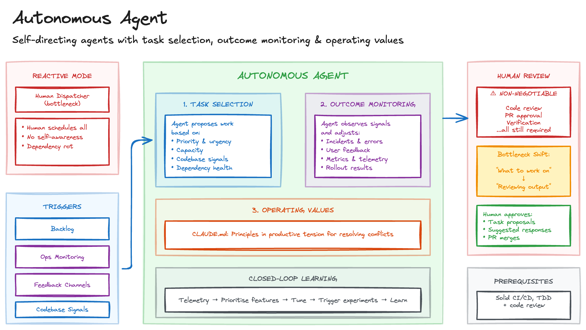

# Autonomous Agent

Current AI coding tools are reactive: humans prompt, agents execute. The human remains the scheduler, deciding what gets worked on and when. This creates bottlenecks. Every task requires someone to assign it. The agent doesn't know what's burning versus what can wait. And the agent can't tell whether its work is actually helping.

The same reactive pattern plagues maintenance and operations: dependency rot accumulates unnoticed, releases follow calendars rather than evidence, and governance is bolted on rather than built in.

## Sketch

## How It Works

The approach enables agents to operate as self-sustaining contributors through three capabilities.

*Task Selection*: the agent proposes what to work on based on priority, urgency, and capacity. At maturity, agents scan codebases and runtime signals to spot dependency rot, outdated frameworks, and performance regressions, recommending targeted refactoring that keeps the tech estate lean.

*Outcome Monitoring*: the agent observes signals (incidents, feedback, metrics) and adjusts focus. At maturity, delivery becomes a closed-loop learning system where telemetry and user feedback prioritise features, tune rollouts, and trigger experiments automatically.

*Operating Values*: the agent operates under defined principles that provide the framework for resolving conflicts. At maturity, this enables dynamic governance: continuous compliance checks, licence monitoring, and policy enforcement that adapt as the stack changes.

Together these capabilities turn shipped systems into self-improving platforms where architecture, delivery, and governance co-evolve.

### The Constraint

Full autonomy promises to remove human scheduling as a bottleneck. But today, human review of all agent output is non-negotiable: code review, PR approval, and verification remain essential guardrails.

This shifts the bottleneck from "deciding what to work on" to "reviewing what was done." True scaling requires advances in agent reliability, automated verification, and trust calibration. Until then, this pattern increases throughput modestly while introducing coordination overhead.

## The Trade-offs

The benefits are real but bounded. Scheduling overhead decreases. Priorities adjust based on actual impact. The agent accumulates context over time. And you establish infrastructure for greater autonomy as tooling matures.

The costs are significant. Prerequisites are steep: you need a solid coordination foundation before this works. Integration is complex, spanning backlogs, monitoring, and feedback channels. And human review is still required for all output.

## When to Use It

This pattern suits mature teams with established CI/CD, testing, and code review. It works for high volumes of well-defined, low-risk tasks, and when human scheduling (not review) is the bottleneck. Teams must be willing to maintain human review as a hard constraint.

Avoid it for early-stage projects with forming requirements, teams without solid coordination foundations, and if you expect this to eliminate human review.

[Detached Agent](detached-agent.md) provides the execution infrastructure; Autonomous Agent adds task selection on top. [Context Library](context-library.md) informs operating values with "what good looks like." [Skills Library](skills-library.md) enables consistent coordination. And [Golden Path Anchor](golden-path-anchor.md) applies outcome monitoring to drift detection.

## Maturity

**Assess.** The vision is compelling but the prerequisites are steep. Human review remains the bottleneck, limiting the throughput gains that autonomy promises. Worth designing toward, not deploying naively.

## Further Reading

- [The Levels of Agentic Coding](https://timkellogg.me/blog/2026/01/20/agentic-coding-vsm) - Tim Kellogg
- Viable System Model - Stafford Beer (1971)
