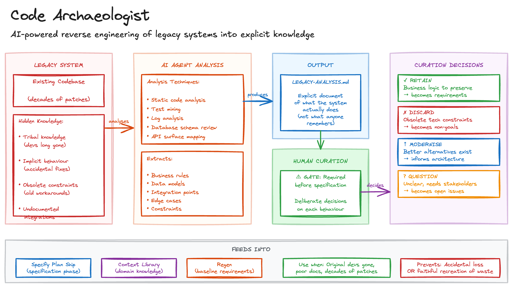

# Code Archaeologist

Replacing legacy systems is one of the riskiest things a team can do, and the reason is almost always the same: critical knowledge exists only in the code. Business rules were encoded by developers long gone. Edge cases are handled by accident rather than design. Workarounds for limitations that no longer exist sit alongside undocumented integration points that you only discover when things break.

Teams replacing legacy systems tend to fall into one of two traps. They either accidentally lose important behaviour, or they faithfully recreate constraints that no longer serve any purpose. Without explicit analysis, you inherit technical decisions from a different era without knowing which ones still matter.

## Sketch

## How It Works

The approach is to use an AI agent to reverse-engineer the existing codebase, extracting implicit knowledge into an explicit document that humans then curate before specification begins.

The agent takes the existing codebase as input and produces a LEGACY-ANALYSIS.md document. It analyses the legacy system to extract business rules (validation logic, calculations, state machines, domain constraints), data models (entities, relationships, invariants, implicit schemas), integration points (external services, APIs, file formats, protocols), edge cases (error handling, boundary conditions, special cases), and constraints (performance characteristics, batch windows, resource limits).

### Human Curation

The analysis is a starting point, not a final answer. Humans must curate it, making deliberate choices about each piece of extracted knowledge.

| Decision      | Meaning                                        | Example                                    |
| ------------- | ---------------------------------------------- | ------------------------------------------ |
| **Retain**    | Business logic that must be preserved          | Tax calculation rules                      |
| **Discard**   | Constraints from obsolete technology           | Batch windows from mainframe era           |
| **Modernise** | Patterns with better contemporary alternatives | Replace polling with event-driven          |
| **Question**  | Unclear behaviour requiring stakeholder input  | Why does this field allow negative values? |

This curation feeds directly into specification. Retained behaviours become requirements. Discarded constraints become explicit non-goals. Modernisation candidates inform architecture decisions. Questioned items become open issues to resolve.

### Analysis Techniques

The agent can employ multiple approaches, and combining techniques produces a more complete picture than any single method.

| Technique              | Extracts                                | Limitations                               |
| ---------------------- | --------------------------------------- | ----------------------------------------- |
| Static code analysis   | Structure, dependencies, data flow      | Misses runtime behaviour                  |
| Test mining            | Expected behaviour from existing tests  | Tests may be incomplete or wrong          |
| Log analysis           | Actual usage patterns, error rates      | Requires access to production logs        |
| Database schema review | Data models, constraints, relationships | Schema drift from application assumptions |
| API surface mapping    | Integration contracts                   | May miss undocumented protocols           |

## The Trade-offs

The benefits centre on risk reduction. You capture what the system _actually does_, not what anyone remembers it doing. You surface obsolete constraints. You force explicit retain-or-discard decisions rather than leaving things to chance. And you create a document explaining why old behaviours were kept or dropped, which proves invaluable when questions arise later.

The costs are front-loaded: the analysis takes effort before any new code exists, the agent needs read access to the legacy codebase, and some knowledge will inevitably exist only in people's heads and cannot be extracted from code alone.

## When to Use It

This pattern earns its keep when replacing systems where original developers are unavailable, migrating from platforms with poor documentation, modernising systems that have accumulated decades of patches, or consolidating multiple systems with overlapping functionality. In my experience, any replacement where "we'll just rebuild it" has failed before is a strong signal that archaeological analysis is needed.

Skip it for greenfield development, simple rewrites where behaviour is already well-documented, and throwaway prototypes not intended as replacements.

Code Archaeologist is fundamentally a prerequisite phase. Its output feeds into [Specify Plan Ship](specify-plan-ship.md) as input to specification, informs the [Context Library](context-library.md) with domain-specific knowledge extracted from legacy code, and supports [Regen](regen.md) by providing baseline requirements that can be re-evaluated as standards evolve.

## Maturity

**Adopt.** Legacy replacement without explicit analysis of existing behaviour is the single most common cause of failed rewrites. Extraction quality varies with codebase characteristics, but even partial analysis dramatically reduces risk.
