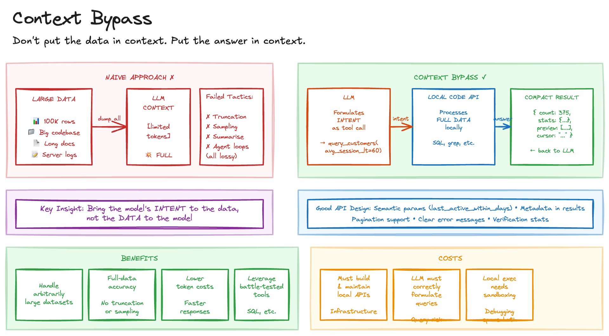

# Context Bypass

## Problem

LLM context windows have hard limits, but real-world tasks routinely exceed them:

- **Large datasets**: A spreadsheet with 100,000 rows won't fit in context
- **Big codebases**: Reading an entire repository exhausts token limits before analysis begins
- **Lengthy documents**: Legal contracts, research corpora, server logs

Common workarounds fail in predictable ways:

| Tactic          | Failure mode                                                        |
| --------------- | ------------------------------------------------------------------- |
| Truncation      | Discards potentially critical information                           |
| Sampling        | Misses patterns visible only in full data                           |
| Summarise-first | Strips fine-grained detail needed for accuracy                      |
| Agent API calls | Adds wiring overhead, bloats parsing context, increases token costs |

The fundamental issue: we're trying to bring the data to the model when we should bring the model's intent to the data.

## Solution

Delegate data-intensive operations to local code APIs. Pass only compact results back to the LLM.

### Sketch



### Core Principle

**Don't put the data in context. Put the answer in context.**

Instead of this:

```
Here are 500,000 rows of event logs: [massive CSV dump]

Find customers who spend less than 1 minute in the app
and were active in the last 30 days...
```

Do this:

```
[Tool call]
query_customers(
  avg_session_lt=60,
  last_active_within_days=30,
  fields=["id", "email", "avg_session_s", "last_active"],
  limit=50
)

[Result]
{
  count: 375,
  stats: {mean: 42, p90: 58},
  preview: [...],
  cursor: "..."
}
```

The LLM receives intent plus answer, not raw data requiring expensive, error-prone parsing.

### Query Design

The critical challenge is **query correctness**: the LLM must translate natural language intent into precise tool calls.

Effective local APIs should:

- Accept semantic parameters (`last_active_within_days`) not just raw filters
- Return metadata alongside results (`count`, `stats`) for verification
- Support pagination for iterative exploration
- Provide clear error messages when queries are malformed

## Tradeoffs

| Benefit                                          | Cost                                 |
| ------------------------------------------------ | ------------------------------------ |
| Handle arbitrarily large datasets                | Must build and maintain local APIs   |
| Full-data accuracy, not truncated samples        | LLM must correctly formulate queries |
| Lower token costs                                | Local execution needs sandboxing     |
| Faster responses (less data transfer)            | Additional infrastructure to deploy  |
| Leverage battle-tested tools (SQL, grep, pandas) | Debugging spans LLM and local code   |

## When to Use

- Datasets exceeding context window limits
- Aggregation tasks over large data (counting, averaging, grouping)
- Needle-in-haystack searches with clear filtering criteria
- Operations where precision matters more than flexibility
- Cost-sensitive applications processing high data volumes

## When to Avoid

- Small datasets that fit comfortably in context
- Exploratory analysis where filtering criteria emerge through iteration
- Tasks where query formulation is harder than just reading the data
- Highly unstructured problems without clear decomposition

## Context Window Growth

Larger context windows reduce how often you must bypass them, but don't eliminate the need. Even with million-token windows:

- Real datasets often exceed any fixed limit
- Cost scales with tokens used
- Latency increases with context size
- Audit and compliance may require local processing

The pattern remains relevant; the threshold simply shifts.

## Sources

- [Tool Use in Claude](https://docs.anthropic.com/claude/docs/tool-use), Anthropic's tool use documentation
- [OpenAI Function Calling](https://platform.openai.com/docs/guides/function-calling), OpenAI's approach to structured tool calls
