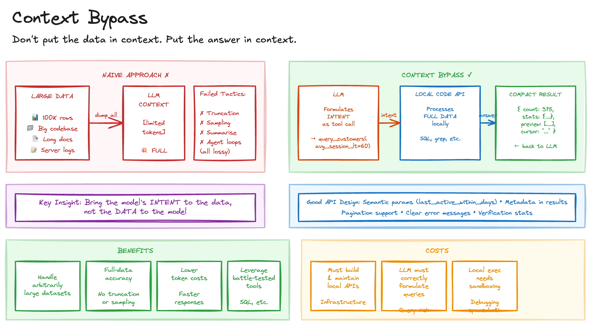

# Context Bypass

> **In plain terms:** AI has a limited working memory and can't process a 100,000-row spreadsheet or an entire codebase at once. Instead of cramming data into the AI, send the AI's question to a local tool that processes the full dataset and returns just the answer.
>
> **What is it?** Delegating data-intensive operations to local code APIs and returning only compact results to the AI, inverting the usual data flow.
> **What's in it for you?** Processing arbitrarily large datasets with full accuracy at lower cost and higher speed.
> **What are the trade-offs?** Requires building and maintaining local APIs; the AI must formulate queries correctly.

LLM context windows have hard limits, but real-world tasks routinely exceed them. A spreadsheet with 100,000 rows won't fit in context. Reading an entire repository exhausts token limits before analysis begins. Legal contracts, research corpora, and server logs all present the same problem.

The common workarounds fail in predictable ways. Truncation discards potentially critical information. Sampling misses patterns visible only in full data. Summarising first strips the fine-grained detail needed for accuracy. And agent API calls add wiring overhead, bloat parsing context, and increase token costs.

The fundamental issue is that we're trying to bring the data to the model when we should bring the model's intent to the data.

## Sketch

## How It Works

The approach delegates data-intensive operations to local code APIs and passes only compact results back to the LLM. The agent formulates a query expressing what it needs. A local API executes the query against the full dataset using battle-tested tools like SQL, grep, or pandas. Only the compact result comes back to the agent's context.

This inverts the data flow. Instead of cramming data into the model, you bring the model's intent to the data.

## The Trade-offs

| Benefit                                        | Cost                                 |
| ---------------------------------------------- | ------------------------------------ |
| Handle arbitrarily large datasets              | Must build and maintain local APIs   |
| Full-data accuracy, not truncated samples      | LLM must correctly formulate queries |
| Lower token costs                              | Local execution needs sandboxing     |
| Faster responses (less data transfer)          | Additional infrastructure to deploy  |
| Leverage battle-tested tools (SQL, grep, etc.) | Debugging spans LLM and local code   |

## When to Use It

This pattern works for datasets exceeding context window limits, aggregation tasks over large data (counting, averaging, grouping), needle-in-haystack searches with clear filtering criteria, operations where precision matters more than flexibility, and cost-sensitive applications processing high data volumes.

It's unnecessary for small datasets that fit comfortably in context, exploratory analysis where filtering criteria emerge through iteration, and tasks where query formulation is harder than just reading the data.

This solves a different problem from [Pyramid Summary](pyramid-summary.md). Context Bypass handles data-heavy processing where you need precise answers from large datasets. Pyramid Summary handles comprehension of large systems where the agent needs a mental model at multiple zoom levels. Different tools for different scaling problems.

## Maturity

**Adopt.** The inversion principle -- bring intent to data rather than data to context -- is clear and practical, and applies to any project where data volume is an issue.

## Further Reading

- [Tool Use in Claude](https://docs.anthropic.com/claude/docs/tool-use) - Anthropic
- [OpenAI Function Calling](https://platform.openai.com/docs/guides/function-calling) - OpenAI
