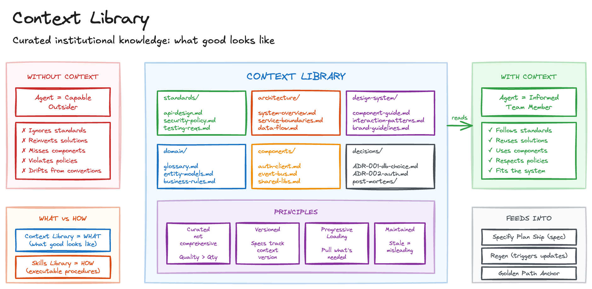

# Context Library

One of the most common frustrations I hear from teams adopting AI agents is that the output looks great but doesn't _fit_. The agent ignores your coding standards, reinvents solutions the team has already built, and misses existing components entirely. It's like hiring a brilliant contractor who refuses to read the company wiki.

The result is code that works in isolation but clashes with the broader system. Without context, agents operate as capable outsiders who don't know what "good" looks like in your organisation.

## Sketch

## How It Works

The remedy is straightforward: curate a library of reference material that agents consult before generating anything. This is the WHAT of your organisation - what good looks like, what's already built, what decisions have been made and why.

The library has several components, each serving a distinct purpose.

_Standards_ define what "good" looks like: API design conventions, security policies, testing requirements, accessibility guidelines, code style. These are the rules you'd want any new team member to follow from day one.

_Architecture_ captures how your system is structured: service boundaries, data flow, integration patterns, infrastructure topology. Agents that understand your architecture produce code that fits.

_Design system_ documents UX patterns and components: the component library, interaction patterns, brand guidelines, visual language. This ensures agents produce interfaces native to your product.

_Domain context_ encodes business knowledge: glossaries, entity models, regulatory requirements, business rules. Agents that understand your domain speak the same language as your team.

_Reusable components_ catalogue what's already built: authentication clients, event bus wrappers, shared libraries. Each should document not just how to use it, but when _not_ to use it.

_Decision records_ explain why past choices were made: Architecture Decision Records, post-mortems, spike findings. These prevent agents from relitigating settled questions.

### Principles

A few principles are worth bearing in mind.

First, the library should be _curated, not comprehensive_. An agent drowning in context performs worse than one with none. Include only high-signal documents. Quality over quantity.

Second, it should be _versioned_. Specs need to track which context version they were generated against. When standards evolve, you need to know what changed.

Third, structure for _progressive loading_. Not all context is needed for every task. Agents should pull in what they need when they need it, not load the entire library for a CSS fix.

Finally, _maintain it_. Stale context actively misleads. Build updates into how your team works, not as a separate documentation burden.

### Structure

A typical layout might look like this:

- **standards/** - api-design.md, security-policy.md, testing-requirements.md
- **architecture/** - system-overview.md, service-boundaries.md
- **design-system/** - component-guide.md
- **domain/** - glossary.md, entity-models.md
- **components/** - auth-client.md, event-bus.md
- **decisions/** - ADR-001-database-choice.md, ADR-002-auth-strategy.md

## The Trade-offs

The benefits are significant. Agents produce output aligned with your standards. Institutional knowledge survives team changes. New agents and humans ramp up quickly. You see fewer violations caught in code review and more reuse over reinvention.

The costs are real too. Building the initial library takes curation effort. Context must stay current to stay useful, and there's a genuine risk of over-specification: too much context constrains the creativity that makes agents valuable in the first place.

## When to Use It

This pattern pays off most for teams with established standards, organisations using AI assistants across multiple projects, and environments with compliance or regulatory requirements. Any situation where "what good looks like" should be consistent is a good candidate.

For one-off prototypes where consistency doesn't matter, skip it.

The [Skills Library](skills-library.md) is a natural companion. Where Context Library defines WHAT good looks like, Skills Library defines HOW to achieve it. Skills often reference context: a security review skill loads the security policy to know what to check against.

Context Library also feeds directly into [Specify Plan Ship](specify-plan-ship.md), informing the specification phase. And when context changes, [Regen](regen.md) can trigger spec and code updates to keep everything aligned.

## Maturity

**Adopt.** The problem is universal and the solution is straightforward. Every team I've seen adopt this reports the same result: agents produce output that fits. The pattern requires no new tooling, just discipline in curation.
