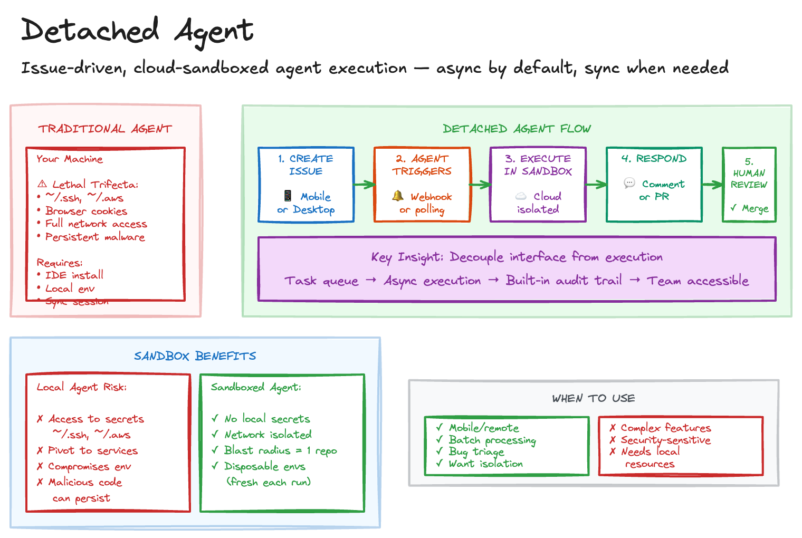

# Detached Agent

## Problem

Traditional AI coding assistants require:

- **IDE installation**: VS Code, Cursor, or specific editors
- **Local environment**: Development dependencies, API keys, compute resources
- **Synchronous interaction**: Active session while agent works
- **Trust in agent execution**: Running code with full access to your machine, credentials, and network (albeit you can implement a sandbox approach to mitigate this)

This creates friction for quick tasks, excludes team members without full development setups, and introduces security risks from the [lethal trifecta](https://simonwillison.net/2025/Jun/16/the-lethal-trifecta/).

## Solution

Use GitHub issues (or similar) as the interface for AI agents, with cloud-based execution in isolated sandboxes.

### Sketch

### How It Works

1. **User creates issue**: Describes the task in natural language
2. **Agent triggers**: Webhook or polling detects new issue
3. **Agent executes**: Sandboxed cloud runner performs the work
4. **Agent responds**: Comments on issue or creates PR
5. **Human reviews**: Merge or provide feedback via comments

### Why This Works

The key insight is **decoupling interface from execution**. By treating issues as task queues, you get:

- Asynchronous execution without blocking your workflow
- Built-in audit trails documenting requests and rationale
- Team accessibility without requiring development environments
- Security isolation

### Limitations and Mitigations

**Feedback loop problem**: When the agent misunderstands the issue, you only discover this after execution completes. Each correction requires another full agent run.

Mitigations:

- Issue templates that force structured input
- Label-based routing to specialised agents
- Automatic scope validation before execution begins
- Clear acceptance criteria in the issue description

**Security surface**: The agent needs write access to the repository.

Mitigations:

- Require approval before agents process issues from external contributors
- Use separate service accounts with minimal permissions
- Log all agent actions for audit
- Restrict agents to specific branches or paths

### Sandboxing Benefits

Cloud-based execution provides security through isolation. Unlike local IDE agents that run with your full user permissions:

| Local Agent Risk                              | Sandboxed Agent                         |
| --------------------------------------------- | --------------------------------------- |
| Access to `~/.ssh`, `~/.aws`, browser cookies | No local secrets accessible             |
| Can pivot to other local services             | Network isolated to specific endpoints  |
| Compromises entire development environment    | Blast radius limited to one repository  |
| Malicious code can persist                    | Disposable environments, fresh each run |

This helps mitigate the lethal trifecta, even if the agent processes untrusted data with powerful tools, the sandbox limits potential damage.

### Variation: Interactive Takeover

The feedback loop problem can be mitigated with **jump-in capability**, allowing developers to attach to a running or paused cloud session.

**How it works:**

1. Agent runs in cloud, streaming progress to a dashboard
2. Developer monitors asynchronously
3. If agent goes off track, developer takes over the session
4. Developer provides guidance, then hands back or completes manually
5. Session state persists through handoff

This provides an **async by default, sync when needed**.

## Costs & Benefits

### Benefits

- **Audit trail**: Issues document what was requested and why
- **Mobile-friendly**: Create issues from phone
- **Sandboxed**: Agent isolated from your credentials and network

### Costs

- **Slow feedback**: Hard to course-correct during execution
- **Scope ambiguity**: Agents may misinterpret vague issues
- **Cloud costs**: Compute resources for each task
- **Security setup**: Requires careful permission configuration

## When to Use

- Mobile or remote scenarios
- Batch processing of similar tasks
- Initial triage of bug reports
- When you want isolation from agent execution

## When NOT to Use

- Complex features requiring iterative discussion
- Security-sensitive changes needing careful review
- Tasks requiring access to local resources or services

## Sources

- [When AI writes almost all code, what happens to software engineering?](https://newsletter.pragmaticengineer.com/p/when-ai-writes-almost-all-code-what) - Gergely Orosz
- [The Lethal Trifecta](https://simonwillison.net/2025/Jun/16/the-lethal-trifecta/) - Simon Willison
