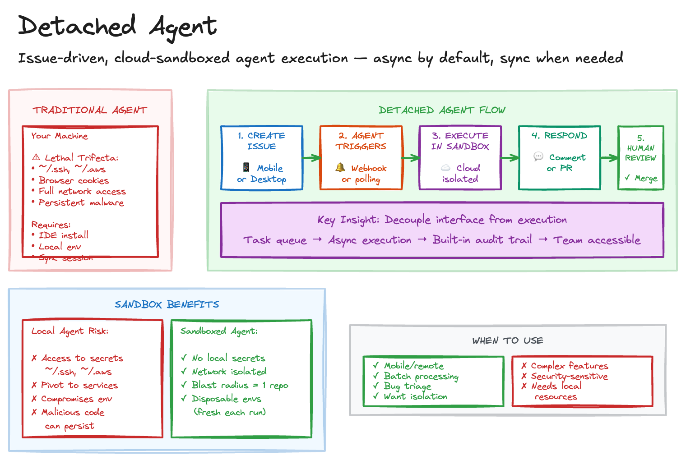

# Detached Agent

Traditional AI coding assistants impose constraints that create friction for many workflows. They require IDE installation: VS Code, Cursor, or specific editors. They need a local development environment with dependencies, API keys, and compute resources. They demand synchronous interaction while the agent works. And they run code with full access to your machine, credentials, and network, which Simon Willison has aptly termed the [lethal trifecta](https://simonwillison.net/2025/Jun/16/the-lethal-trifecta/).

This creates friction for quick tasks, excludes team members without full development setups, and introduces security risks that are hard to mitigate.

## Sketch

## How It Works

The idea is to use GitHub issues (or similar) as the interface for AI agents, with cloud-based execution in isolated sandboxes. The key insight is *decoupling interface from execution*.

A user creates an issue describing the task in natural language. A webhook or polling mechanism detects it and triggers the agent. The agent executes in a sandboxed cloud runner, then comments on the issue or creates a PR. A human reviews and merges or provides feedback via comments.

By treating issues as task queues, you get asynchronous execution without blocking your workflow, built-in audit trails documenting requests and rationale, team accessibility without requiring development environments, and security isolation.

### Sandboxing Benefits

Cloud-based execution provides security through isolation. Unlike local IDE agents that run with your full user permissions, sandboxed agents have no access to local secrets like `~/.ssh` or `~/.aws`. They cannot pivot to other local services. They cannot compromise your entire development environment. And they run in disposable environments that are fresh each run.

### Limitations

The feedback loop is the primary weakness. When the agent misunderstands the issue, you only discover this after execution completes. Each correction requires another full agent run.

Mitigations help: issue templates that force structured input, label-based routing to specialised agents, automatic scope validation before execution begins, and clear acceptance criteria in the issue description.

The security surface also needs attention. The agent needs write access to the repository, which means requiring approval before agents process issues from external contributors, using separate service accounts with minimal permissions, logging all agent actions for audit, and restricting agents to specific branches or paths.

### Interactive Takeover

The feedback loop problem can be further mitigated with jump-in capability. The agent runs in the cloud, streaming progress to a dashboard. A developer monitors asynchronously. If the agent goes off track, the developer takes over the session, provides guidance, then hands back or completes manually. Session state persists through the handoff. This gives you async by default, sync when needed.

## The Trade-offs

The benefits are clear: audit trails documenting what was requested and why, mobile-friendly issue creation, and sandboxed execution isolated from your credentials and network.

The costs are equally clear: slow feedback that makes course-correction difficult during execution, scope ambiguity where agents may misinterpret vague issues, cloud compute costs for each task, and careful permission configuration for security.

## When to Use It

This works well for mobile or remote scenarios, batch processing of similar tasks, initial triage of bug reports, and situations where you want isolation from agent execution.

It's a poor fit for complex features requiring iterative discussion, security-sensitive changes needing careful review, and tasks requiring access to local resources or services.

[Autonomous Agent](autonomous-agent.md) builds on this pattern, adding task selection and outcome monitoring on top of the execution infrastructure. [Agent Swarm](agent-swarm.md) uses the same async execution model but adds coordination across multiple agents.

## Further Reading

- [When AI writes almost all code, what happens to software engineering?](https://newsletter.pragmaticengineer.com/p/when-ai-writes-almost-all-code-what) - Gergely Orosz
- [The Lethal Trifecta](https://simonwillison.net/2025/Jun/16/the-lethal-trifecta/) - Simon Willison
