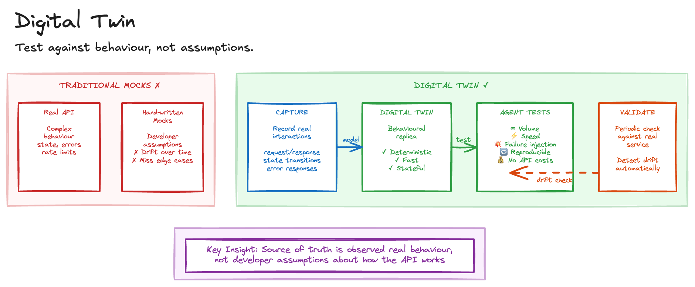

# Digital Twin

> **In plain terms:** When AI agents write code that talks to external services, testing is expensive, slow, and unreliable. A digital twin captures how the real service behaves, then replays that behaviour locally - giving agents a fast, free, controllable test double.
>
> **What is it?** A local replica of a third-party dependency's behaviour, built from observed real interactions rather than developer assumptions.
> **What's in it for you?** Deterministic, high-speed integration testing at any volume without API costs or flaky external dependencies.
> **What are the trade-offs?** Substantial upfront effort to capture and model behaviour, plus ongoing maintenance to prevent drift.

AI agents writing integration code need to test against external dependencies - APIs, databases, cloud services - but the reality of doing so is painful. Real APIs charge per call, making testing at scale expensive. External services return different results at different times, producing flaky tests. Third-party services go down, blocking development entirely. Edge cases like error conditions and timeouts are difficult to reproduce. And network calls slow test suites to the point where thorough testing becomes impractical.

Mocking is the traditional answer, but hand-written mocks drift from real behaviour. You end up testing the mock rather than the integration.

## Sketch

## How It Works

The idea is to clone the externally observable behaviour of critical third-party dependencies into local replicas that agents can test against at any volume, speed, or failure condition.

The process has four stages. First, *capture*: record real interactions with the external dependency, including request/response pairs, state transitions, and error responses. Second, *model*: build a behavioural replica that reproduces the dependency's observable contract. Third, *validate*: verify the twin against the real service periodically to detect drift. Fourth, *test*: agents run integration tests against the twin with full control over conditions.

### What Makes This Different from Mocks

The distinction matters. Traditional mocks are sourced from developer assumptions, have no drift detection, are typically stateless, and author edge cases manually. A digital twin is sourced from observed real behaviour, validates automatically against the live service, preserves stateful interactions, and captures edge cases from production.

| Aspect | Traditional mocks | Digital twin |
| --- | --- | --- |
| Source of truth | Developer assumptions | Observed real behaviour |
| Drift detection | None | Automated validation |
| State management | Typically stateless | Preserves stateful interactions |
| Edge cases | Manually authored | Captured from production |

## The Trade-offs

The benefits are substantial: deterministic testing where identical inputs always produce identical outputs, the ability to test at rates far exceeding production limits, failure injection on demand, local execution speed, and no API charges during development.

The costs are front-loaded. You must record sufficient real interactions to model behaviour. Twins need periodic revalidation against the real service. Undiscovered edge cases remain unmodelled. And it is another system to build and maintain.

## When to Use It

This pattern works well for testing integrations with rate-limited or paid APIs, reproducing specific failure conditions for debugging, load testing that would exceed production quotas, CI pipelines needing fast and reliable integration tests, and agent workflows that iterate rapidly against external services.

It's overkill for simple, stateless APIs where basic mocks suffice, services with official sandbox environments that already meet testing needs, and trivial integrations with one or two endpoints.

When paired with [Validation Constraint](validation-constraint.md), you get a powerful combination: clone dependencies for deterministic testing, then validate agent output through observable behaviour rather than code review.

## Maturity

**Assess.** Building behavioural replicas of third-party dependencies requires substantial investment, and keeping twins synchronised adds ongoing maintenance burden. Worth evaluating for systems with expensive or unreliable external dependencies, but not yet proven as a general practice.

## Further Reading

- [Software Factory Techniques](https://factory.strongdm.ai/techniques) - StrongDM
