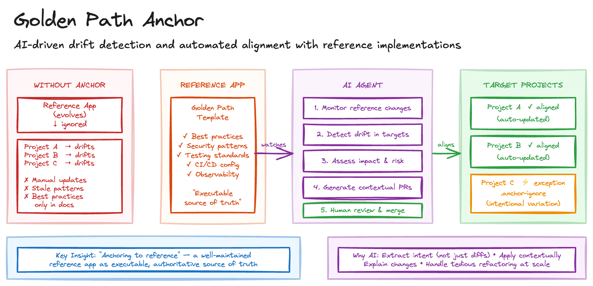

# Golden Path Anchor

> **In plain terms:** Organisations maintain reference applications showing best practice, but once teams fork them, codebases diverge. AI agents can continuously compare your projects against the reference, detect drift, and open PRs to bring them back into alignment.
>
> **What is it?** AI-driven continuous alignment of codebases with reference implementations through automated drift detection and contextual remediation PRs.
> **What's in it for you?** Best practices propagate automatically across all projects, not just new ones.
> **What are the trade-offs?** The reference becomes the critical path - poor quality causes fleet-wide harm; legitimate variations need explicit exception handling.

Organisations maintain reference applications - templates, starter kits, golden paths - that embody best practices. These references work well for new projects but fail to influence existing ones. Once teams fork templates, codebases diverge over time. Propagating template improvements to existing projects is tedious and error-prone. And the reference app evolves while downstream projects don't follow.

The result is that "best practices" exist only in documentation and new projects, while the bulk of the codebase operates on outdated patterns.

## Sketch

## How It Works

The approach uses an AI agent to continuously align codebases with reference implementations through drift detection and automated remediation.

The process has five stages. *Reference monitoring* watches for changes to the reference application. *Drift detection* compares target codebases against latest patterns. *Impact analysis* assesses scope and risk of updates. *Automated remediation* generates PRs with contextual updates. And *human review* ensures engineers approve and merge changes.

### Why This Works

The key insight, described by Birgitta Böckeler as "anchoring to reference," is that a well-maintained reference application can serve as an executable, authoritative source of truth for coding standards.

AI agents make this practical at scale because they can extract patterns rather than just diffs, understanding the intent behind reference code. They apply changes contextually, adapting patterns to different codebases rather than blind copy-paste. They explain why updates align with reference standards. And they handle the kind of tedious refactoring that's mind-numbing for humans but routine for AI.

### Limitations

There are three significant limitations worth understanding.

*Structural similarity*: the pattern assumes reference and target share similar architecture. When targets have legitimately different structures, the agent must distinguish "drift to fix" from "intentional variation." Mitigations include `.anchor-ignore` files for explicit exceptions, confidence thresholds where low-confidence suggestions require human triage, and pattern-level rules defining which patterns are mandatory versus recommended.

*Reference quality*: bad patterns propagate automatically too. A flawed security practice in the reference becomes a fleet-wide vulnerability. This requires rigorous review of reference changes, staged rollout to canary projects before fleet-wide propagation, and easy rollback mechanisms for problematic updates.

*Review overhead*: PRs still need human approval, which can become a bottleneck. Auto-merging for low-risk, high-confidence updates helps, along with clear categorisation of breaking versus non-breaking and security versus style changes.

## The Trade-offs

The benefits are compelling. Best practices propagate automatically. Updates flow with minimal manual effort. All projects stay aligned. Traceability from reference to implementation simplifies auditing. And teams don't need to track what's changed in the reference.

The costs are real. The reference application becomes the critical path: poor quality causes fleet-wide harm. Legitimate variations require explicit exception handling. The tooling investment for comparison, PR generation, and tracking is non-trivial. The agent may flag acceptable variations as drift. And too many auto-generated PRs can overwhelm teams.

## When to Use It

This works for organisations with multiple similar applications (microservices, multi-tenant), platform teams maintaining golden paths, compliance environments requiring consistent implementation, and large teams where manual standardisation doesn't scale.

Avoid it for small teams with few projects, highly diverse applications with little shared structure, unstable reference applications, projects with legitimate architectural differences from the reference, and early-stage organisations where patterns are still being discovered.

## Maturity

**Adopt.** Continuous alignment with reference implementations is well-proven in platform engineering. The reference quality concern is real but manageable with rigorous review of reference changes and staged rollout.

## Further Reading

- [Anchoring AI to Reference Applications](https://martinfowler.com/articles/exploring-gen-ai/anchoring-to-reference.html) - Birgitta Böckeler
