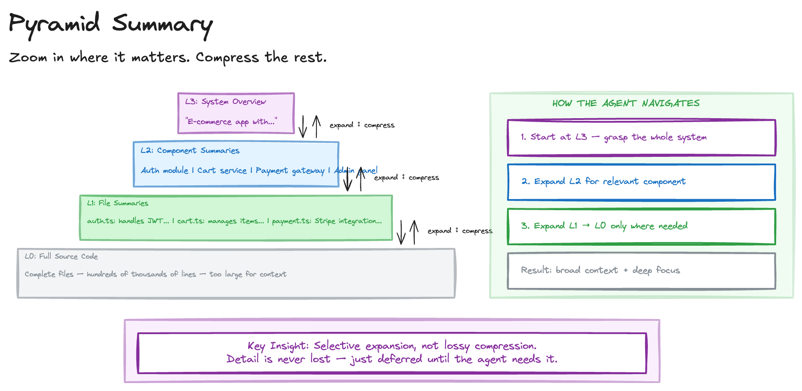

# Pyramid Summary

> **Pattern in Research**: This pattern describes a direction rather than current best practice. Generating reliable multi-level summaries and keeping them in sync with evolving source material remains an open problem. Treat this as a lens for thinking about context management, not a turnkey solution.

## Sketch

## Problem

Agents working with large codebases or documents face a fundamental tension:

- **Full detail exhausts context**: Loading everything gives accuracy but exceeds token limits
- **Summarisation loses detail**: Compressing to fit discards the fine-grained information needed for precision
- **One-way compression**: Once summarised, the original detail is gone from context and cannot be recovered without re-reading

This is different from [Context Bypass](context-bypass.md), which delegates to external tools. Here the problem is that the agent needs to hold a mental model of a large system in its own context while retaining the ability to drill into specifics.

## Solution

Build reversible summaries at multiple zoom levels, so agents can navigate between overview and detail on demand.

### How It Works

1. **Layer 0 - Full source**: The complete, uncompressed content (files, documents, data)
2. **Layer 1 - Section summaries**: Each file or module condensed to key facts, interfaces, and responsibilities
3. **Layer 2 - Component summaries**: Groups of related files summarised into architectural descriptions
4. **Layer 3 - System overview**: The entire system in a paragraph or two

Agents start at the top layer and expand downward only where needed, keeping the rest compressed.

### Why It Works

- **Selective attention**: Most context stays compressed; only the relevant portion expands
- **Reversible**: Any layer can be expanded to the layer below, so detail is never permanently lost
- **Fits context**: The pyramid shape means the full set of summaries is far smaller than the source material
- **Navigable**: Agents can reason about which branch to explore before committing tokens to it

## Costs and Benefits

### Benefits

- **Large codebase comprehension**: Agents can reason about systems that far exceed context limits
- **Precision where it matters**: Expand only the relevant section to full detail
- **Reusable**: Summaries persist across sessions; regenerate only when source changes
- **Token-efficient**: Hold broad understanding and deep focus simultaneously

### Costs

- **Summary quality**: Bad summaries at upper layers misdirect exploration
- **Generation cost**: Building the pyramid takes time and tokens upfront
- **Staleness**: Summaries must be regenerated when source material changes
- **Layer design**: Deciding the right granularity for each layer requires judgement

## When to Use

- Agents exploring unfamiliar large codebases
- Multi-step tasks requiring both breadth (understanding the system) and depth (modifying specific code)
- Long-running sessions where re-reading source files wastes tokens
- Documentation generation requiring understanding at multiple levels

## When Not to Use

- Small codebases that fit in context without compression
- Tasks focused on a single file or function where full detail is always needed
- When [Context Bypass](context-bypass.md) is more appropriate (data processing vs. comprehension)

## Related Patterns

- Complements [Context Bypass](context-bypass.md) - Pyramid Summary handles comprehension; Context Bypass handles data processing
- Supports [Context Library](context-library.md) - summaries can be stored as reference material
- Enables [Agent Swarm](agent-swarm.md) - each worker agent receives only the relevant pyramid layers

## Sources

- [Software Factory Techniques](https://factory.strongdm.ai/techniques) - StrongDM
