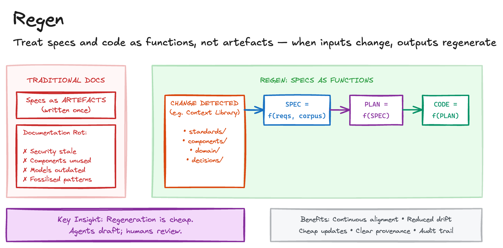

# Regen

Traditional documentation rots. Teams write specs once, then watch them drift from reality until they're worse than useless. The same happens with AI-assisted development: agents produce code based on requirements that become stale as standards evolve, dependencies update, and business rules change.

The maintenance burden compounds. Security standards tighten, but existing code isn't updated. New components become available, but old implementations don't adopt them. Domain models evolve, but specs reference outdated terminology. Best practices improve, but codebases fossilise around old patterns. Manual updates don't scale. Teams either fall behind or spend disproportionate effort keeping everything aligned.

## Sketch

## How It Works

The core idea is to treat specifications and implementations as functions, not artefacts.

- SPEC = f(requirements, corpus)
- PLAN = f(SPEC)
- CODE = f(PLAN)

When inputs change, outputs regenerate, all the way down. A security standard updates, affected specs regenerate, plans adapt, and code follows. This isn't rework; it's keeping the entire system aligned with reality.

Regeneration is cheap. Agents draft; humans review.

### Dependency Tracking

Every SPEC.md declares what it depends on: `corpus/standards/security-policy.md@v2.1`, `corpus/components/auth-client.md@v1.3`, `corpus/domain/customer-model.md@v4.0`. When any dependency changes, dependency scanning identifies which specs need review. This can be automated: a security policy update triggers a list of affected specs, the agent proposes updates, and humans approve or reject.

### Regeneration Triggers

There are three main triggers.

[Context Library](context-library.md) changes propagate through the entire chain. When a standard in the library updates, affected specs regenerate, plans adapt, and implementations are updated to match.

Discovery during implementation surfaces gaps. When building reveals the spec missed something, the spec updates, the plan adjusts, and code changes cascade. The discipline is to fix gaps at the source rather than patching around them.

Scheduled reviews catch drift. Periodic freshness checks ensure nothing falls too far behind. Treat it like dependency updates: regular, incremental, not a massive catching-up exercise.

## The Trade-offs

The benefits centre on alignment. Systems stay current with evolving standards. Regular regeneration prevents large catch-up efforts. Agents draft changes while humans review rather than rewrite. Every spec knows what it depends on and why. And version control tracks what changed and when.

The costs are operational. Dependency tracking and scanning need tooling. More regeneration means more human review cycles. And not every corpus change requires spec updates, so false positives need management.

## When to Use It

This pattern pays off for systems that must track evolving standards or regulations, long-lived applications where maintenance matters, multi-team environments where consistency across projects is valuable, compliance contexts requiring demonstrable currency, and any system where "we'll update it later" means "we'll never update it."

Skip it for short-lived prototypes, stable domains with infrequent standard changes, and early-stage work where specs are still forming.

This connects naturally to [Context Library](context-library.md) (the vetted knowledge that specs depend on), [Specify Plan Ship](specify-plan-ship.md) (the workflow that produces specs and plans), [Code Archaeologist](code-archaeologist.md) (extracting initial requirements from legacy systems), and [Golden Path Anchor](golden-path-anchor.md) (applying similar regeneration thinking to reference applications).

## Maturity

**Trial.** The principle is compelling but dependency tracking and managing review load when many specs regenerate simultaneously needs tooling that is still maturing. Worth implementing for long-lived systems with evolving standards.

## Further Reading

- [Anchoring AI to Reference Applications](https://martinfowler.com/articles/exploring-gen-ai/anchoring-to-reference.html) - Birgitta Böckeler
