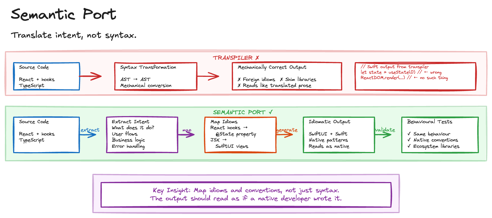

# Semantic Port

Porting code between languages or frameworks is common but painful. Manual translation is slow and error-prone. Syntax-level tools like transpilers and converters produce technically correct but unidiomatic output. Framework conventions differ profoundly: a React component and a SwiftUI view solve the same problem with entirely different patterns. And when the source continues to evolve, the port must track changes continuously.

Traditional automated translation treats code as syntax to be converted. The result compiles but doesn't read like code a native developer would write.

## Sketch

## How It Works

The approach uses AI agents to perform semantically-aware ports that preserve intent and produce idiomatic output in the target language or framework.

The process has four stages. *Extract intent*: analyse the source code to understand what it does and why, not just how. *Map idioms*: identify the target language's native patterns for expressing the same intent. *Generate idiomatically*: produce code that follows the target ecosystem's conventions, naming, and structure. *Validate behaviourally*: verify the port preserves the original's observable behaviour through tests.

### One-Time vs. Ongoing

A *one-time port* migrates a codebase from one language to another. The source is archived; the target becomes canonical.

An *ongoing port* keeps source and target co-existing. Changes in the source propagate to the target automatically. This is useful for maintaining SDKs across multiple languages from a single reference implementation.

### What Makes This Different from Transpilation

The distinction is important. A transpiler takes a syntax tree as input and produces mechanically correct code. It uses source language error handling patterns, looks for direct library equivalents or shims, and produces output that compiles but reads foreign. A semantic port takes intent and behaviour as input and produces idiomatic code. It uses target language error handling patterns, adopts native ecosystem libraries, and produces output that reads like code a native developer would write.

| Aspect | Transpiler | Semantic port |
| --- | --- | --- |
| Input | Syntax tree | Intent and behaviour |
| Output | Mechanically correct code | Idiomatic code |
| Error handling | Source language patterns | Target language patterns |
| Dependencies | Direct equivalents or shims | Native ecosystem libraries |
| Result | Compiles but reads foreign | Reads like native code |

## The Trade-offs

The benefits are significant. Generated code follows target ecosystem conventions. Agents port in minutes what takes developers days. Continuous ports keep multi-language projects aligned. And business logic survives translation intact.

The costs centre on verification. Behavioural equivalence must be verified, not assumed. Some patterns have no clean equivalent in the target. Subtle language differences in threading models and error handling risk silent behavioural changes. And tests must also be ported or rewritten for the target.

## When to Use It

This works for maintaining SDKs or libraries across multiple languages, migrating codebases between frameworks (Angular to React, UIKit to SwiftUI), porting reference implementations to new platforms, and keeping multi-language projects synchronised with a single source of truth.

Avoid it when a rewrite from scratch would be simpler, for trivial codebases where manual translation is faster than setting up the process, and when source and target languages are too conceptually different for meaningful mapping.

[Spec Library](spec-library.md) defines what to implement; Semantic Port provides the mechanism for generating language-specific code. [Regen](regen.md) ensures that when the source evolves, the port regenerates. And [Validation Constraint](validation-constraint.md) provides the behavioural tests that verify port correctness.

## Further Reading

- [Software Factory Techniques](https://factory.strongdm.ai/techniques) - StrongDM
