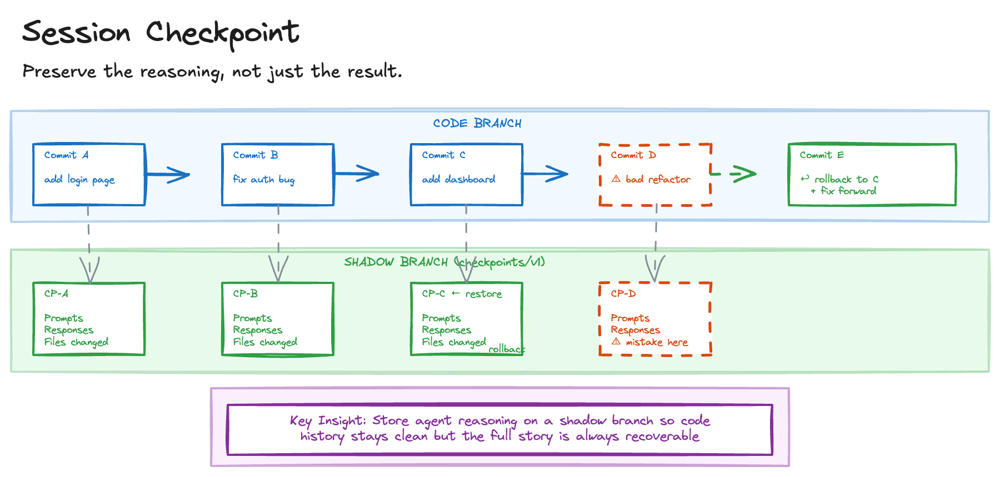

# Session Checkpoint

AI agent sessions are surprisingly opaque. When an agent makes a destructive change, recovery means manual git archaeology. The chain of thought behind code changes disappears when the session ends. You cannot revisit an earlier point in a session to branch in a different direction. And team members reviewing agent-assisted code have no visibility into how it was produced.

Agent output looks like any other commit, but the process that created it is fundamentally different from human development and worth preserving.

## Sketch

## How It Works

The approach captures agent sessions as a sequence of checkpoints with full context - prompts, responses, file changes - stored on a separate branch to keep code history clean.

The process involves five steps. *Session recording* captures all agent interactions from start to finish. *Checkpoint creation* saves restore points at each commit or agent response. *Shadow storage* keeps session metadata on a dedicated branch (e.g. `checkpoints/v1`), not in the code branch. *Rollback* allows rewinding to any checkpoint without losing the session context that led there. And *summarisation* auto-generates summaries of intent, outcomes, and learnings at commit time.

### What Gets Captured

Each checkpoint records the prompts sent to the agent, the agent's responses and reasoning, files modified at each step, timestamps and model identifiers, and auto-generated session summaries.

## The Trade-offs

The appeal is clear. Safe experimentation with rollback capability. Team visibility into how agent-assisted code was produced. A complete audit trail from prompt to committed code. Knowledge capture through summaries that preserve intent and learnings. And support for tracking concurrent sessions independently in multi-agent workflows.

The costs are operational. Session metadata accumulates over time. The tooling requires integration with your agent and git workflow. Too much metadata can overwhelm rather than inform. And shadow branches need periodic cleanup.

## When to Use It

This pattern is valuable for teams adopting AI agents where code review norms require understanding provenance, high-stakes codebases where rollback capability matters, onboarding scenarios where reviewing past agent sessions accelerates learning, and multi-agent workflows where concurrent sessions must be tracked independently.

Skip it for solo prototyping, short single-purpose agent interactions, and environments where git branch restrictions prevent shadow branches.

This complements [Specify Plan Ship](specify-plan-ship.md) by preserving the reasoning behind implementation decisions, and supports [Agent Swarm](agent-swarm.md) by tracking concurrent agent sessions independently with rollback capability.

## Further Reading

- [Entire CLI](https://github.com/entireio/cli) - Entire.io
