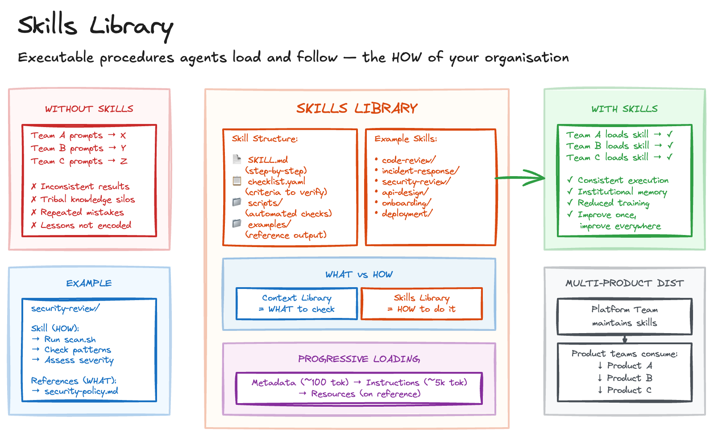

# Skills Library

## Sketch

## Problem

Organisations have procedures that should be followed consistently, but agents don't know them:

- **Inconsistent execution**: Each team prompts differently, producing divergent approaches to the same task
- **Tribal knowledge silos**: "How we do things" lives in senior engineers' heads or scattered prompt libraries
- **Repeated mistakes**: Teams rediscover the same pitfalls because lessons aren't encoded into workflows

The gap between "how we should do X" and "how agents actually do X" widens as AI agents become common.

## Solution

Package procedures as executable skills that agents load and follow. This is the HOW - step-by-step instructions for performing specific tasks the way your organisation does them.

Agents execute these skills to do work consistently across teams and projects.

### Skills vs Context

Skills Library complements [Context Library](context-library.md):

| Context Library (WHAT)     | Skills Library (HOW)          |
| -------------------------- | ----------------------------- |
| Security policy standards  | Security review procedure     |
| API design conventions     | API design workflow           |
| Accessibility requirements | Accessibility audit checklist |
| Architecture patterns      | Architecture review process   |

Skills often _reference_ context. A security review skill (HOW to review) loads the security policy (WHAT to check against).

### Skill Structure

Package each skill as a portable unit:

- **SKILL.md** - Step-by-step instructions
- **checklist.yaml** - Structured criteria to verify
- **scripts/** - Automated checks to run (e.g., scan.sh)
- **examples/** - Reference output (e.g., good-review.md)

When an agent encounters a matching task ("review this PR for security"), it loads the skill and follows the instructions.

### Example Skills

**Code review workflow**: How to review PRs - what to check first, how to structure feedback, when to approve vs request changes, how to handle disagreements.

**Incident response**: How to handle production incidents - triage steps, communication templates, escalation paths, post-mortem process.

**Security review**: How to audit code for vulnerabilities - what tools to run, what patterns to look for, how to assess severity, how to document findings.

**API design**: How to design new endpoints - naming conventions, versioning approach, error response format, documentation requirements.

**Onboarding**: How to set up a new service - required infrastructure, configuration steps, integration checklist, validation process.

### Multi-Product Distribution

Platform teams maintain skills (security-review, incident-response, api-design, code-review) that product teams consume. When the platform team improves a procedure, all products apply the updated workflow automatically.

### Progressive Loading

Context is expensive. Structure skills so agents pull in what they need:

1. **Metadata** (~100 tokens): Always loaded, describes when to activate
2. **Instructions** (~5k tokens): Loaded on activation, the actual procedure
3. **Resources** (variable): Loaded only when referenced (checklists, examples)

## Costs and Benefits

### Benefits

- **Consistent execution**: All teams follow the same procedures
- **Institutional memory**: "How we do things" survives team (agent) changes
- **Reduced training**: New agents (and humans) follow established workflows
- **Continuous improvement**: Update the skill once, improve everywhere

### Costs

- **Upfront investment**: Creating good skills takes effort
- **Maintenance burden**: Skills go stale without active curation
- **Coordination overhead**: Platform and product teams must align on interfaces

## When to Use

- Procedures that should be consistent across teams
- Tasks with established best practices worth encoding
- Compliance workflows requiring demonstrable process
- Onboarding scenarios where consistency matters
- Any process where "how we do it here" should be uniform

## When Not to Use

- Exploratory work where the procedure is still being discovered
- Procedures changing too rapidly to be worth encoding

## Related Patterns

- [Context Library](context-library.md): Reference material that skills check against (WHAT vs HOW)
- [Golden Path Anchor](golden-path-anchor.md): Applies reference patterns across codebases
- [Spec Library](spec-library.md): Similar packaging approach for reusable functionality

## Sources

- [Agent Skills Specification](https://agentskills.io/), Open standard for portable agent skills
- [lane-assist](https://github.com/jackrwstevenson/lane-assist), Working example of executable skills for Claude Code
