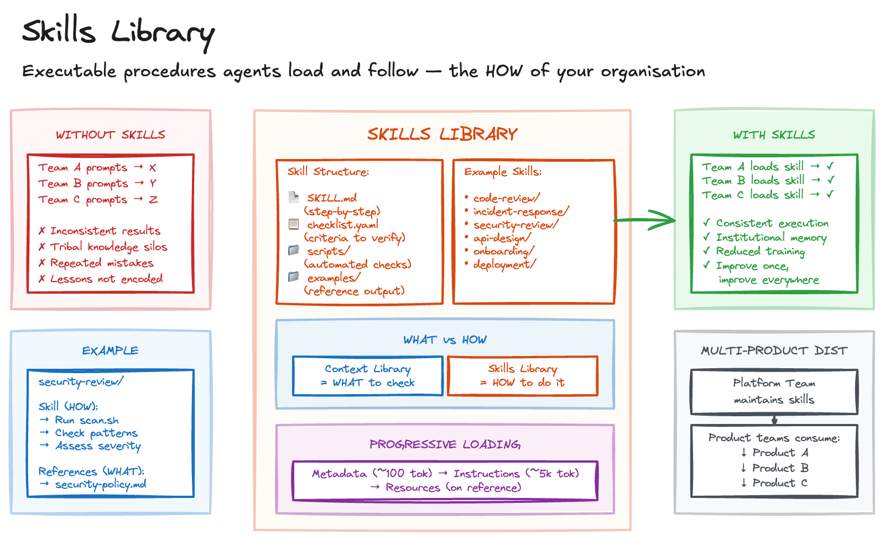

# Skills Library

Organisations have procedures that should be followed consistently, but agents don't know them. Each team prompts differently, producing divergent approaches to the same task. "How we do things" lives in senior engineers' heads or scattered prompt libraries. Teams rediscover the same pitfalls because lessons aren't encoded into workflows.

The gap between "how we should do X" and "how agents actually do X" widens as AI agents become common across an organisation.

## Sketch

## How It Works

The approach is to package procedures as executable skills that agents load and follow. This is the HOW: step-by-step instructions for performing specific tasks the way your organisation does them. Agents execute these skills to do work consistently across teams and projects.

### Skills vs Context

Skills Library complements the [Context Library](context-library.md). Where the Context Library defines WHAT good looks like (security policy standards, API design conventions, accessibility requirements), the Skills Library defines HOW to achieve it (security review procedure, API design workflow, accessibility audit checklist).

Skills often *reference* context. A security review skill (how to review) loads the security policy (what to check against).

### Skill Structure

Each skill is packaged as a portable unit: a SKILL.md with step-by-step instructions, a checklist.yaml with structured criteria to verify, a scripts/ directory for automated checks, and optionally an examples/ directory with reference output.

When an agent encounters a matching task ("review this PR for security"), it loads the skill and follows the instructions.

### Example Skills

A *code review workflow* defines how to review PRs: what to check first, how to structure feedback, when to approve versus request changes, how to handle disagreements. An *incident response* skill covers triage steps, communication templates, escalation paths, and the post-mortem process. A *security review* skill specifies which tools to run, which patterns to look for, how to assess severity, and how to document findings. An *API design* skill covers naming conventions, versioning, error response format, and documentation requirements.

### Multi-Product Distribution

Platform teams maintain skills like security-review, incident-response, api-design, and code-review. Product teams consume them. When the platform team improves a procedure, all products apply the updated workflow automatically. This is one of the most powerful aspects of the pattern.

### Progressive Loading

Context is expensive. Structure skills so agents pull in only what they need. Metadata (roughly 100 tokens) is always loaded and describes when to activate. Instructions (roughly 5,000 tokens) load on activation. Resources like checklists and examples load only when referenced.

## The Trade-offs

The benefits are significant: consistent execution across teams, institutional memory that survives team changes, reduced training burden, and the ability to update a skill once and improve everywhere.

The costs are the usual suspects: upfront investment in creating good skills, maintenance burden to keep them fresh, and coordination overhead between platform and product teams on interfaces.

## When to Use It

This pattern makes sense for procedures that should be consistent across teams, tasks with established best practices worth encoding, compliance workflows requiring demonstrable process, and any process where "how we do it here" should be uniform.

Avoid it for exploratory work where the procedure is still being discovered, and procedures changing too rapidly to be worth encoding.

[Golden Path Anchor](golden-path-anchor.md) applies similar thinking to reference applications, and [Spec Library](spec-library.md) uses comparable packaging for reusable functionality.

## Further Reading

- [Agent Skills Specification](https://agentskills.io/) - Open standard for portable agent skills
- [lane-assist](https://github.com/jackrwstevenson/lane-assist) - Working example of executable skills for Claude Code
