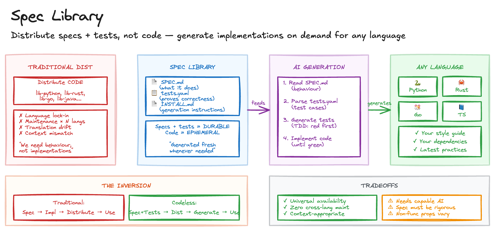

# Spec Library

> **In plain terms:** Traditional libraries ship code in one language. A spec library ships the specification and tests instead, letting AI generate a correct implementation in any language on demand. The spec is the product; the code is disposable.
>
> **What is it?** Distributing specifications and test suites rather than code, with AI generating language-specific implementations on demand.
> **What's in it for you?** Universal language availability with zero cross-language maintenance - one spec serves every platform.
> **What are the trade-offs?** Requires rigorous specifications; non-functional properties like performance and security are less predictable in generated code.

Traditional software distribution treats code as the primary artefact, and this creates several friction points. A library exists for Python but not Rust, leaving developers to write their own or go without. Each language variant requires separate upkeep, bug fixes, and version management. Ports and reimplementations slowly diverge from the original's behaviour. And downloaded code may clash with your environment, style guide, or dependency constraints.

The root issue is that we distribute implementations when what we actually need is behaviour.

## Sketch

## How It Works

The approach inverts software distribution: distribute the specification and tests instead of code. Let AI generate implementations on demand, tailored to any language or context.

The specification defines _what_ the library does. The tests prove _whether_ an implementation is correct. The code itself becomes ephemeral, generated fresh whenever needed.

### Structure

A Spec Library contains a SPEC.md with behavioural requirements in plain language, a tests.yaml with language-agnostic test cases, an INSTALL.md with generation instructions for users, and optionally an examples/ directory with sample outputs.

The SPEC.md covers each function's purpose, signature, precise behavioural description, constraints and invariants, and edge case handling. The tests.yaml defines test cases with a descriptive name, the function under test, input arguments, and expected output (or error).

### Generation

The generation prompt instructs the agent to read SPEC.md for behavioural requirements, parse tests.yaml for test cases, generate tests in the target language first (following TDD red-green-refactor), implement functions until all tests pass, and follow local conventions for style and idioms.

### The Inversion

The traditional flow is: specification, implementation, distribution, usage. The codeless flow is: specification plus tests, distribution, generation, usage.

The novel insight is that specifications and tests are the durable artefacts. Implementations are disposable.

## The Trade-offs

| Benefit                                  | Cost                                                        |
| ---------------------------------------- | ----------------------------------------------------------- |
| Universal language availability          | Requires capable AI for generation                          |
| Zero cross-language maintenance          | Specification must be rigorous; ambiguity causes drift      |
| Context-appropriate output (style, deps) | Non-functional properties (perf, security) less predictable |
| Always current with latest practices     | Generation time on each use                                 |
| Smaller distribution size                | Users need AI access                                        |

## When to Use It

This pattern works for utility libraries with clear, testable behaviour (parsing, formatting, validation), cross-platform tools needed in multiple languages, and internal libraries where "correct and readable" beats "maximally optimised."

Avoid it for performance-critical code requiring hand-tuned optimisation, security-sensitive implementations requiring formal verification, and specifications changing faster than regeneration is practical.

[Semantic Port](semantic-port.md) uses a related approach: specs define what to implement, Semantic Port generates idiomatic implementations across languages. And [Regen](regen.md) applies similar thinking to keeping generated implementations current when the source specification evolves.

## Maturity

**Trial.** The economics are clear for cross-language utility libraries, and Drew Breunig's demonstration is compelling. The pattern is young; not yet ready for performance-critical or security-sensitive implementations.

## Further Reading

- [A Software Library with No Code](https://www.dbreunig.com/2026/01/08/a-software-library-with-no-code.html) - Drew Breunig
- [whenwords](https://github.com/dbreunig/whenwords) - Reference implementation of the pattern
