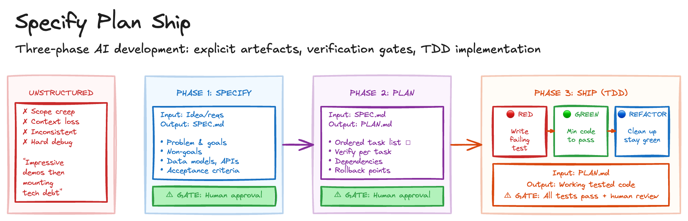

# Specify Plan Ship

> **In plain terms:** AI agents produce impressive code fast, but without structure they wander, over-engineer, or miss requirements. This pattern breaks AI-assisted development into three phases - write a spec, break it into a plan, build with tests - each approved by a human before moving on.
>
> **What is it?** A three-phase workflow (Specify, Plan, Implement) with explicit documents and human approval gates between each phase.
> **What's in it for you?** Predictable, high-quality AI output with problems caught early in design rather than late in code.
> **What are the trade-offs?** Upfront effort creating specs and plans before any code exists; overkill for trivial fixes.

Teams using AI agents often experience a frustrating arc: impressive initial demos followed by mounting technical debt as agents produce code that works but doesn't fit the broader system. The root cause is almost always the same. Without boundaries, agents wander into over-engineering or miss requirements entirely. Long sessions degrade quality as agents lose track of goals and constraints. Results vary wildly without structured feedback loops. And when things go wrong, it's unclear where the process failed.

The underlying issue is that agents lack persistent memory and operate within finite context windows. They need external scaffolding to compensate for these limitations.

## Sketch

## How It Works

The approach structures AI-assisted development into three distinct phases, each producing an explicit artefact and gated by human approval before proceeding.

For brownfield environments replacing legacy systems, use the [Code Archaeologist](code-archaeologist.md) pattern first to extract implicit business rules before specification begins.

### Phase 1: Specification

The human and agent collaborate to flesh out requirements through iterative questioning. Where available, the agent consults a [Context Library](context-library.md) of vetted standards, components, and domain knowledge. The agent asks clarifying questions until edge cases and constraints are clear. Requirements, architecture decisions, data models, API contracts, and testing strategy are all captured in a structured SPEC.md document.

A useful progression for this conversation works through five levels, each requiring agreement before moving on: **capabilities** (what the system should do and explicit non-goals), **components** (the major building blocks and abstractions), **interactions** (how components communicate and data flows between them), **contracts** (function signatures, types, schemas, and error shapes), and finally **implementation approach** (libraries, patterns, and constraints the code should follow). Catching a scope mismatch in a two-minute design conversation is fundamentally cheaper than discovering it woven through hundreds of lines of generated code.

A good SPEC.md covers the problem statement and goals, explicit non-goals (what's out of scope), data models and type definitions, API or interface contracts, error handling strategy, security and performance constraints, and acceptance criteria in testable terms.

The spec becomes the source of truth that both human and agent reference throughout. Nothing proceeds until the human approves it.

There is, however, a subtle problem with a specification that exists only as prose. As Shaw observes, a written spec captures intent well at the moment of writing, but that intent erodes as work continues. After several prompts or sessions, the agent no longer holds the constraints from earlier work. The human reviewer is checking diffs against their recollection of the spec rather than against an automated contract. Behavioural regressions creep in not through obvious breakage but through quiet drift - an edge case handled differently when a function is regenerated, a constraint from an earlier session silently dropped.

Shaw's remedy, which maps neatly onto this phase, is to derive an executable acceptance test suite from the spec before any implementation begins. The process is straightforward. Walk through SPEC.md and pull out every statement that describes observable behaviour. Group these into three buckets: the primary workflow, alternate valid paths, and error or boundary scenarios. If fewer than a fifth of the assertions cover boundaries and errors, the spec likely has gaps worth addressing before moving on.

Hand the grouped assertions to the agent and generate the test suite with no implementation behind it. Run it and confirm every test fails. A fully red suite is the baseline - any test that passes before code exists points to either a flawed test or leftover code from previous work.

The test names should read as a plain-language index of the feature's contract. What this amounts to is classic outside-in BDD, but with the spec as the starting point rather than a blank test file. The derivation is largely mechanical, making it well-suited to agent collaboration. The resulting suite serves as the persistent memory that agent sessions lack: a contract that continues to enforce the spec's intent long after the original context has scrolled out of the window.

### Phase 2: Planning

With an approved specification and a red acceptance suite in hand, the next step is breaking it into small, verifiable implementation tasks. Each task should be completable in one focused session, with explicit verification criteria (typically a test command) and mapped dependencies. The result is a PLAN.md with an ordered task list, descriptions, files touched, verification commands, and rollback points where you can safely stop.

A good plan enables "one-shot" implementation where each step can be completed without rework. Again, human approval is required before implementation begins.

### Phase 3: Implementation

Execute each task from the plan, working through the acceptance suite methodically: red-green-refactor.

Pick a failing acceptance test. Write the *minimum code* necessary to make it pass. No cleverness, no optimisation, no "while I'm here" improvements. Once green, refactor: remove duplication, improve names, simplify logic, running the full suite after each change to ensure nothing regresses. Commit after each cycle. Add finer-grained unit tests where the acceptance test doesn't adequately cover internal logic.

The discipline matters. One behaviour per cycle. Never skip the failing test. Never skip the refactor. The acceptance suite gives you a progress meter - X of Y passing - that works across sessions and provides a precise signal when a later change silently violates an earlier requirement. This creates a clear, auditable history of small, verified commits.

### Why This Works for Agents

The three-phase structure compensates directly for core LLM limitations:

| LLM Limitation | How This Pattern Compensates |
| --- | --- |
| Limited context window | SPEC.md and PLAN.md externalise working memory |
| No persistent memory | Documents persist across sessions; acceptance suite encodes spec as executable memory |
| Overconfidence | Verification gates catch errors early |
| Scope drift | Explicit non-goals and task boundaries |
| Cross-session spec drift | Upfront acceptance tests catch silent regressions against earlier requirements |
| Quality degradation over time | Small cycles with mandatory refactoring |

## Scaling the Pattern

Not every task needs the full ceremony. For trivial fixes, skip the documents entirely. For small, single-function changes, a mental note suffices as a spec. For medium features, a brief SPEC.md and task list. For large multi-file changes, the full process. For epics spanning multiple sessions, add sub-specs and milestones.

The rule of thumb: if you'd want to be able to hand the work to a different agent mid-way, you need the documents.

## The Trade-offs

The benefits compound over time. Quality improves through structured feedback. Humans review the spec and plan before expensive implementation, catching issues early. When problems arise, you can trace back to the specific phase and step. Work can pause and resume without losing context. And SPEC.md and PLAN.md serve as living documentation.

The costs are mostly upfront. Creating specs and plans takes effort before any code exists. Simple bug fixes don't need the full cycle. Documents can drift from reality if not updated. And teams need practice to write good specs and plans.

## When to Use It

This pattern pays for itself on new feature development with unclear requirements, complex changes spanning multiple files or systems, and work that will be reviewed by others or maintained long-term. It's also valuable when onboarding AI assistants to a new codebase.

For trivial bug fixes, obvious errors, and single-line changes with clear scope, it's overhead. For exploratory prototyping, use [Throwaway Spike](throwaway-spike.md) instead.

[Regen](regen.md) treats specs as functions that regenerate when inputs change, which pairs naturally with this workflow.

## Maturity

**Adopt.** This is the foundational workflow for AI-assisted development. The three-phase structure directly compensates for LLM limitations, and the discipline of TDD compounds over time. Teams that skip it consistently accumulate debt faster than teams that don't.

## Further Reading

- [My LLM coding workflow](https://medium.com/@addyosmani/my-llm-coding-workflow-going-into-2026-52fe1681325e) - Addy Osmani
- [Design-First Collaboration](https://martinfowler.com/articles/reduce-friction-ai/design-first-collaboration.html) - Rahul Garg
- [Trust, but verify](https://www.linkedin.com/pulse/trust-verify-julias-shaw-yqdoc/) - Julias Shaw (on deriving executable test suites from specs before implementation)
