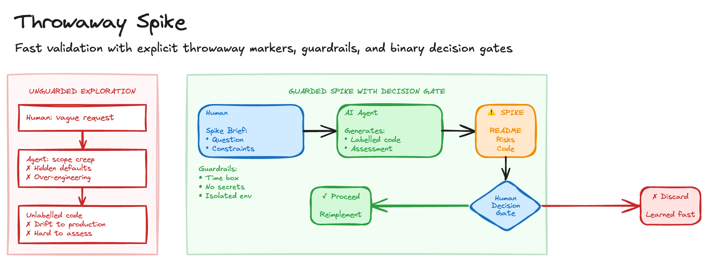

# Throwaway Spike

Traditional development practices - tests, code review, documentation - create overhead that makes sense for production code but actively hinders early-stage exploration. You end up spending time on code quality for experiments that may be discarded, over-thinking architecture for throwaway code, and building production-quality implementations for concepts that don't pan out.

When an AI agent drives the spike, new risks appear alongside new opportunities. The agent can over-engineer or miss the target without a tightly scoped brief. Automated code may insert unsafe placeholders or attempt network calls. And the output that looks clean is easily copy-pasted into production, which is perhaps the most dangerous outcome of all.

## Sketch

## How It Works

The idea is to treat the agent as a focused, constraint-driven developer with a strict brief: a success criterion, allowed libraries, prohibited actions, time box, and required deliverables. The agent produces a runnable, labelled prototype and a concise assessment that lets humans make a clear binary decision: proceed or discard.

### The Spike Brief

Before starting, the human prepares a structured brief. It should state the question to answer in one sentence, the observable success criterion, sample inputs and test data, an explicit allowlist of libraries, forbidden actions (no network calls, no real credentials, no database writes), and the expected deliverables.

### Spike Characteristics

The spike is prompt-first, driven entirely by the brief. It covers the happy path only: the minimal flow to prove the idea, with no error handling, no edge cases, no production hardening. All artefacts include a clear `THROWAWAY, DO NOT SHIP` header and machine-checkable marker. The agent must not embed secrets, production credentials, or make live calls to production services. Prefer a single file unless the idea genuinely requires multiple files. And critically, a named human reviewer must run the artefact and sign off before any next steps.

### Required Deliverables

The agent must produce a runnable prototype clearly labelled with a SPIKE marker, a README with a one-liner to execute it, two or three verification steps a human can run in under five minutes, a list of assumptions made and things deferred, risk notes on security, scale, or operational concerns observed, and a recommendation: promising, uncertain, or unpromising.

### Isolation Rules

To prevent accidental promotion to production, all spike code lives in `/spikes/` or a dedicated branch. Spike code must not import from or be imported by production code. And lint rules or CI checks should fail if spike markers reach the main branch.

## The Trade-offs

The benefits are compelling. Agents produce runnable proof-of-concepts in hours rather than days. Developers spend review time, not implementation time. Standard briefs yield repeatable, comparable outputs. Labels and isolation reduce accidental promotion. More ideas get tested in the same time budget. And even failed spikes document what doesn't work, which has genuine value.

The risks are real too. Clean AI output may hide gaps and be mistakenly promoted. Agents may not surface non-functional risks around security, scale, and operations. Strong norms are needed to keep spike and production standards separate. And writing good briefs takes practice; bad briefs yield bad spikes.

## When to Use It

Spikes work well for validating a new library, SDK, or API integration, proving a parsing algorithm or data transformation, exploring a language feature or framework capability, testing feasibility of a technical approach, fast experiments during hackathons or discovery sprints, and comparing two implementation strategies quickly.

Avoid them for anything touching production data or sensitive systems, work requiring realistic performance or load testing, and integrations that need real authentication flows. For production-quality work that proves the idea, move on to [Specify Plan Ship](specify-plan-ship.md).

## Further Reading

- [Spike Solutions in XP](http://www.extremeprogramming.org/rules/spike.html) - Time-boxed experiments
