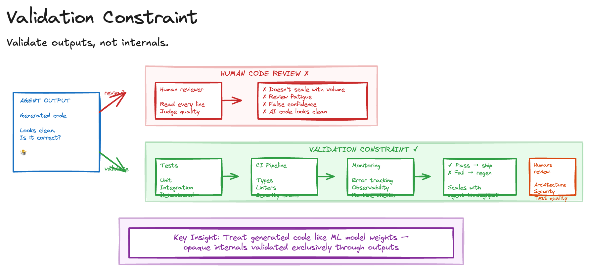

# Validation Constraint

> **Pattern in Research**: This pattern describes a direction rather than current best practice. Replacing human code review with automated validation requires mature test infrastructure and carries risks for security-sensitive code. Treat this as a lens for scaling agent output verification, not a mandate to stop reading code.

Traditional code review doesn't scale to AI-generated code, and the reasons are worth understanding clearly. Agents produce code faster than humans can meaningfully review it. Reviewing unfamiliar code line-by-line is slow and error-prone. AI-generated code often looks clean and well-structured, creating a dangerous illusion of correctness. And the sheer volume of agent output degrades review quality over time.

The instinct is to read the code carefully, but this approach collapses when agents produce substantial output in minutes.

## Sketch

## How It Works

The alternative is to validate agent output exclusively through externally observable behaviour: tests, integration checks, and runtime verification. Treat generated code like ML model weights - opaque internals validated through outputs.

This rests on a few principles. *Tests are the specification*: if the tests pass, the implementation is acceptable; if they don't, it's not. Code style and structure are secondary. *Write tests first*: define expected behaviour before the agent generates code, making the tests the acceptance criteria. *Automate verification*: rely on CI pipelines, type checkers, linters, and integration suites rather than human reading. *Observe in production*: use monitoring, error tracking, and observability tools to catch what tests miss.

### What Changes

| Traditional review | Validation constraint |
| --- | --- |
| Read every line of code | Read test specifications |
| Judge implementation quality | Judge behavioural correctness |
| Humans are the primary gate | Automated checks are the primary gate |
| Review speed limits throughput | Test coverage limits throughput |

### Human Review Still Matters For

This isn't an argument for eliminating human review. It remains essential for architecture and design decisions, security-sensitive code paths, test quality and coverage completeness, and boundary definitions about what to test and what to trust.

The shift is from "humans review all code" to "humans review the things that matter most, and automated checks handle the rest."

## The Trade-offs

The benefits are compelling. Automated checks run as fast as agents produce code. Tests either pass or fail, removing subjective judgement on style. Each verification layer catches different classes of defect. And time spent writing good tests pays dividends across all future agent output.

The costs are equally real. The constraint is only as strong as the test suite: bad tests validate bad code. Behaviour not covered by tests or monitoring goes unvalidated. Teams accustomed to line-by-line review may resist the cultural shift. And comprehensive test infrastructure must exist before agents become productive.

## When to Use It

This pattern works for high-volume agent output where human review is the bottleneck, codebases with strong existing test suites, teams already practising TDD or behaviour-driven development, and situations where agent-generated code is treated as replaceable (regenerate rather than debug).

Avoid it for security-critical code requiring manual audit, novel architectures where tests can't yet capture intent, early-stage projects where the specification is still fluid, and codebases where test infrastructure is immature or absent.

This pairs naturally with [Specify Plan Ship](specify-plan-ship.md), where TDD is already part of the workflow. It enables [Agent Swarm](agent-swarm.md) by removing human review as the throughput bottleneck. And it supports [Regen](regen.md), since automated validation makes regeneration low-risk.

## Further Reading

- [Software Factory Techniques](https://factory.strongdm.ai/techniques) - StrongDM
